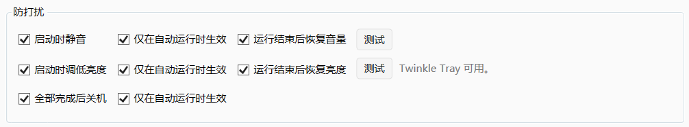
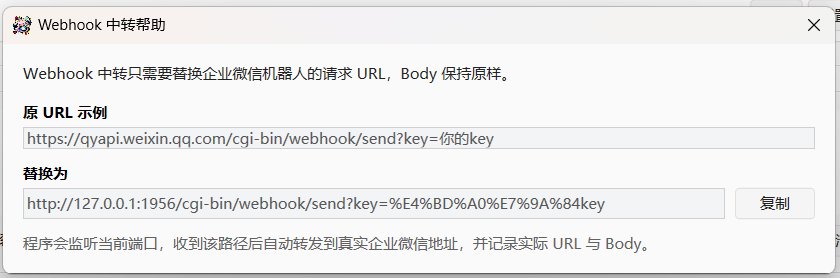
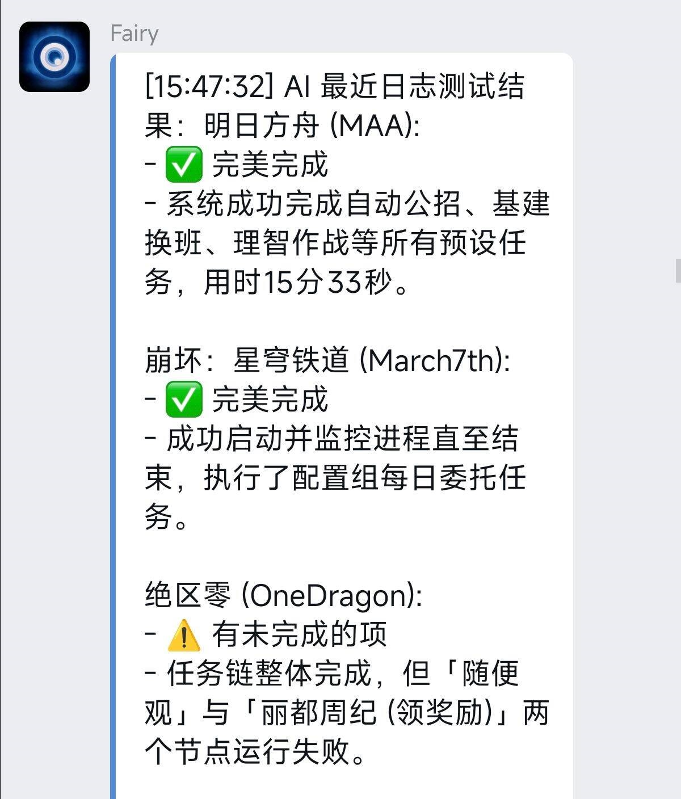
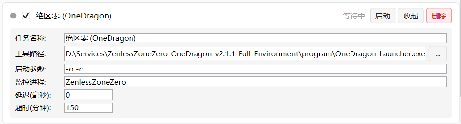
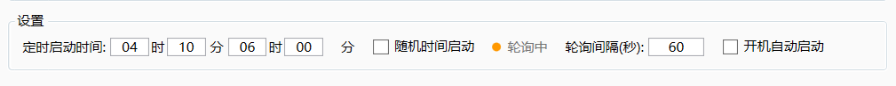
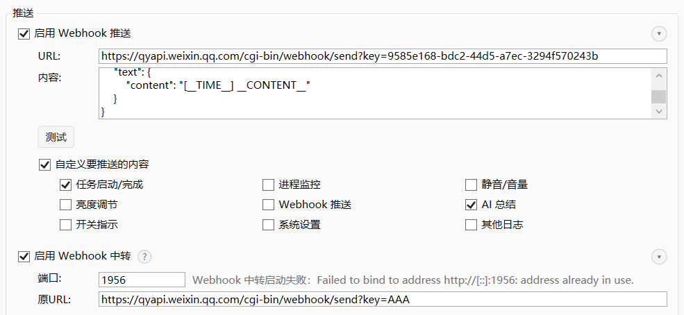
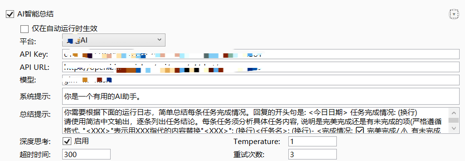

<div align="center">
  
  <h1>Maaa Assorted Assistant Arranger</h1>
  <p>
    
  </p>
  <p>
    <a href="CHANGELOG.md">CHANGELOG</a>
  </p>
  <p>
    游戏日常助手Hub, 可用来集中编排多款游戏自动化工具的启动、监控、通知与收尾流程.
  </p>
  <p>
    本程序和 <a href="https://github.com/MaaAssistantArknights/MaaAssistantArknights">MAA (MaaAssistantArknights)</a> 没有直接关联, 但很适合搭配使用.
  </p>
  <p>
    除了链式启动, MAAA还集成了许多实用的自动化功能, 让你可以每天几乎无需消耗心智在无聊的日常上.
  </p>
  <p>
    <em>可能是你用过的最好的助手编排器 !</em>
  </p>
  <h1></h1>
</div>


除了启动各个助手, 本程序还提供以下全面且实用的功能:


### 开机静默运行

- 支持活跃时间配置. 在非活跃时间段不产生任何影响, 在活跃时间段内开工! 

- 搭配米家智能插座+BIOS来电自启设置, 在你睡觉的时候静默开启一条龙, 完成任务后自动关机, 醒来时已然清新无负担🌿.

<p align="center">
  
</p>


### 多重防打扰 

- 活跃时间内**自动静音**🔕+**调低屏幕亮度**☀️(需搭配Twinkle Tray), 不打扰正在熟睡的你.

- 特别支持计划任务高**优先级启动**, 把开机时其他程序的提示音也扼杀在摇篮中.

<p align="center">
  
</p>


### 完善的过程链和保底机制:

- 从进程层面监控每个助手的运行情况, 实现**无人托管的自动链式运行**.

- 具有**超时保底**机制, 如果某个游戏因为需要更新/助手内部错误等问题无法运行, 也不会影响其它助手的功能.


### 额外的Webhook推送和中转:

- MAAA单独维护了一套Webhook推送功能, 对一些不支持Webhook的助手友好, 让你至少能得知对应助手的运行状态.

- 支持**Webhook中转服务**. 将你原本的推送桥接到MAAA上, 不仅能实现原本的推送功能, 还能让MAAA得知更多助手内部状态, 用于接下来的AI总结.

<p align="center">
  
</p>


### AI智能总结

- 通过接入外部的免费大模型, 对助手们今天的工作情况做汇总, 让你无需花费精力二次验收.

<p align="center">
  
</p>


## 安装与运行

<p align="center">
  
</p>

### 直接使用

从 [Releases](https://github.com/SHthemW/MaaaAssortedAssistantArranger/releases) 下载最新版本，解压后运行主程序即可。

### 首次启动

程序首次启动会在可执行文件同目录生成 `appsettings.Local.json`，后续配置会自动保存到该文件。

### 自动运行

- 在界面中勾选“开机自动启动”后，程序会通过 Windows 计划任务注册当前实例的登录自启动项。
- 自动运行模式会以 `--autorun` 参数启动。
- 如果当前时间不在允许的自动启动时间窗内，程序会静默退出，不弹出主界面。


## 配置说明

所有界面配置都会自动保存到程序目录下的 `appsettings.Local.json`。通常不需要手动编辑该文件；如果你要迁移配置，可以在关闭程序后复制这个文件到新版本程序目录中。

### 任务配置

<p align="center">
  
</p>

**这是你唯一必须要设置的配置.** 任务列表中的每一项代表一个自动化助手或一个需要被纳入流程的工具。勾选任务左侧的复选框表示启用该任务；点击“配置”可以展开详细配置。

- **任务名称**：显示在任务列表和日志中的名称。建议写成“游戏名 + 助手名”，例如 `明日方舟 (MAA)`，方便在日志、Webhook 和 AI 总结中识别是哪一个任务。
- **工具路径**：填写要启动的助手程序路径，或填写已注册的 URI。普通程序建议点击 `...` 选择 `.exe` 文件，例如 `D:\Tools\MAA\MAA.exe`；URL 任务可以填写类似 `bettergi://startOneDragon` 的地址。配置后，点击单个任务的“启动”或点击“启动全部”时，程序会按该路径拉起对应工具。
- **启动参数**：填写传给工具的命令行参数，例如 `-o -c`、`--auto-start`。如果目标助手不需要参数，留空即可。该项只对普通文件路径启动生效；启动后参数会原样传给对应 `.exe`。
- **监控进程**：填写游戏或助手运行时的进程名，不需要 `.exe` 后缀，例如 `YuanShen`、`ZenlessZoneZero`、`Wuthering Waves`。配置后，MAAA 会在启动任务后等待该进程出现并退出，进程退出才认为该任务完成，然后继续下一个任务；留空则启动工具后立即认为该任务完成。
- **延迟(毫秒)**：填写启动该任务前等待的时间，单位是毫秒，例如 `30000` 表示等待 30 秒。适合给上一个助手收尾、游戏启动器更新、模拟器初始化留时间。填 `0` 表示不额外等待。
- **超时(分钟)**：填写等待监控进程退出的最长时间，默认 `60`。如果超过该时间进程仍未退出，当前任务会被标记为超时并结束等待，任务链会继续处理后续任务，避免一个游戏卡住影响整条流程。
- **是否启用**：任务左侧复选框控制该任务是否参与“启动全部”。关闭后，该任务仍保留在列表中，但自动任务链会跳过它；仍可根据界面状态手动调整后再启用。
- **删除**：删除当前任务配置。删除后该任务不会再保存到 `appsettings.Local.json`，需要重新添加才能恢复。
- **新增任务**：点击任务列表底部的 `+` 可以添加一个新任务。新增后建议先填写任务名称、工具路径和监控进程，再根据需要设置延迟与超时。

其中原神默认支持通过 `bettergi://` URI 方式启动，使用前需要本机已正确安装并注册 BetterGI 协议。

### 防打扰配置

<p align="center">
  
</p>

- **启动时静音**：任务链开始时立即把系统音量静音并调到 0。适合夜间自动运行，避免游戏、启动器或助手发出提示音。
- **仅在自动运行时生效（静音）**：只在程序通过 `--autorun` 自动启动时执行静音；你手动打开程序并点击“启动全部”时不会自动静音。
- **运行结束后恢复音量**：任务链结束或程序清理时恢复启动前记录的静音状态和音量。关闭该项后，程序不会主动恢复音量，需要你自行调整。
- **测试静音**：立即执行一次静音/恢复相关动作，用于确认当前系统音频控制是否可用。
- **启动时调低亮度**：任务链开始时通过 Twinkle Tray 把显示器亮度调到最低。适合配合夜间开机自动运行，降低屏幕打扰。
- **仅在自动运行时生效（亮度）**：只在 `--autorun` 自动启动时调低亮度；手动运行任务链时不会改变亮度。
- **运行结束后恢复亮度**：记录任务开始前的各显示器亮度，并在任务结束或程序退出清理时恢复。关闭后，亮度会保持在被调低后的状态。
- **测试亮度**：立即尝试调用 Twinkle Tray 调低或恢复亮度，用于确认 Twinkle Tray 是否安装、正在运行并可被本程序调用。
- **全部完成后关机**：所有启用任务执行完成后调用系统关机。适合无人值守任务链，建议确认任务配置稳定后再开启。
- **仅在自动运行时生效（关机）**：只在 `--autorun` 自动运行完成后关机；手动点击“启动全部”完成后不会关机。

亮度控制依赖本机正在运行的 Twinkle Tray。

### 调度配置

<p align="center">
  
</p>

- **定时启动时间**：配置自动运行允许生效的时间窗，格式为“开始时:分 + 结束时:分”，例如 `04:00` 到 `06:00`。程序通过开机自启进入 `--autorun` 模式时，会先判断当前时间是否位于该时间窗内；不在窗口内会静默退出，不弹主界面、不启动任务链。结束时间早于开始时间时表示跨天窗口，例如 `23:30` 到 `02:00`。
- **随机时间启动**：开启后，程序不会在进入时间窗后立刻运行任务，而是在当前或下一段时间窗内随机抽取一个启动时刻。适合避免每天固定时间访问游戏或助手服务。关闭后，只要自动运行进入时间窗，就会按正常流程启动任务链。
- **轮询间隔(秒)**：随机启动或等待时间窗时检查时间的间隔，单位为秒，默认 `60`。数值越小，触发时间越精确，但检查更频繁；普通使用保持默认即可。
- **开机自动启动**：勾选后，程序会通过 Windows 计划任务注册当前程序路径的登录自启动项，并以 `--autorun` 参数启动。取消勾选会移除该自启动项。因为绑定的是当前程序路径，移动程序目录后建议重新勾选一次。

### Webhook 配置

<p align="center">
  
</p>

- **启用 Webhook 推送**：开启后，MAAA 会把运行日志按配置发送到指定 Webhook。关闭后不发送任何普通推送，但不影响本地日志记录。
- **URL**：填写接收推送的 Webhook 地址，例如企业微信机器人、Server 酱或其它兼容 HTTP POST 的地址。配置后，运行日志产生时会向该地址发送请求；如果为空，则不会推送。
- **内容**：填写 POST 请求体模板，默认是 `{"time":"__TIME__","content":"__CONTENT__"}`。`__TIME__` 会替换为日志时间，`__CONTENT__` 会替换为日志内容。模板应保持为目标平台要求的 JSON 格式；如果目标平台需要 `msgtype`、`text` 等字段，需要在这里按平台要求补全。
- **测试**：立即按当前 URL 和内容模板发送一条测试推送，用于确认 URL、请求体格式和网络连通性。
- **自定义要推送的内容**：开启后，可以按日志分类选择推送范围。可选分类包括任务启动/完成、进程监控、静音/音量、亮度调节、Webhook 推送、AI 总结、开关指示、系统设置和其他日志。关闭该项时，符合条件的普通日志都会推送。
- **仅推送 AI 总结结果**：只推送最终 AI 总结，不推送过程日志。适合只想早上看结果、不想收到大量任务过程消息的场景。该项需要同时配置好 AI 智能总结才有实际效果。
- **启用 Webhook 中转**：开启后，MAAA 会在本机启动一个本地 HTTP 服务，接收其它助手原本发往外部 Webhook 的请求，并在记录日志后继续转发到原始目标。这样既保留原助手推送，又能让 MAAA 收集更完整的上下文用于日志和 AI 总结。
- **端口**：填写本地中转服务监听端口，默认 `5058`。需要确保端口没有被其它程序占用。配置后，本机或局域网内可按 `http://本机IP:端口/原路径?原查询参数` 的形式访问中转服务。
- **原URL**：填写原本助手要发送到的 Webhook 完整地址，例如 `https://qyapi.weixin.qq.com/cgi-bin/webhook/send?key=你的key`。MAAA 会使用这个地址的协议、域名和路径建立映射，并把收到的请求 Body 原样转发到真实地址。

Webhook 中转会监听本地端口，并按照“原始 URL 的路径和查询参数”进行映射转发。

### AI 总结配置

<p align="center">
  
</p>

当前已接入智谱 AI。开启后，任务链结束时会把本次运行日志整理成提示词并发送给模型，由模型生成一段任务完成情况总结。

- **AI智能总结**：总开关。关闭时不会请求 AI，也不会生成总结；开启后需要继续配置平台、API Key、模型等参数。
- **仅在自动运行时生效**：只在程序通过 `--autorun` 自动运行任务链时生成总结；手动点击“启动全部”不会生成总结。关闭后，手动运行和自动运行都会在结束后尝试生成总结。
- **平台**：选择 AI 服务提供方。目前界面提供智谱 AI、ChatGPT 和 DeepSeek。切换平台会决定后续 API Key、API URL、模型等字段如何被使用。
- **API Key**：填写当前平台生成的 API Key。该值会保存在本地 `appsettings.Local.json` 中，用于请求模型接口；未填写时无法生成总结。
- **API URL**：填写聊天补全接口地址，默认 `https://open.bigmodel.cn/api/paas/v4/chat/completions`。通常保持默认即可；只有在智谱接口地址变更或使用兼容服务时才需要修改。
- **模型**：填写要调用的模型名，默认 `glm-4.7-flash`。模型决定总结速度、质量、费用和是否支持深度思考等能力；如果接口返回模型不存在或不支持，需要改为你账号可用的模型。
- **HTTP(S) 代理**：代理设置属于当前选中的 AI 平台，各平台可以单独开启或关闭。开启后填写完整代理地址，例如 `http://127.0.0.1:7890`，如果代理需要认证还可以填写用户名和密码；关闭后该平台强制使用直连，不使用系统代理，目前不支持 SOCKS 代理。
- **系统提示**：发送给模型的 system 指令，用来定义模型角色和整体回答风格。默认是通用助手提示。你可以改成更偏验收、报错分析或简短汇报的风格。
- **总结提示**：发送给模型的主要任务要求，用来告诉模型如何阅读日志、如何输出任务结论。留空时会自动恢复默认提示词。想让总结更严格或更短，可以在这里写明“逐项列出是否完成、失败原因、需要人工处理的事项”等要求。
- **深度思考**：控制请求体中的 thinking 开关。开启后，支持该能力的模型可能会进行更充分的分析，适合日志较复杂、需要判断是否真正完成的场景；关闭后通常响应更直接。
- **Temperature**：控制输出随机性。数值越低越稳定、越像固定格式；数值越高表达更发散。日志总结建议使用较低到中等数值，如果希望每次格式稳定，可以适当降低。
- **超时时间**：等待 AI 接口响应的最长秒数，默认 `800`。日志较长、模型较慢或开启深度思考时可以调大；调太小可能导致总结尚未返回就被判定超时。
- **重试次数**：请求失败后最多重试的次数，默认 `3`。适合处理临时网络波动或接口偶发失败。填 `0` 表示失败后不重试。
- **重试间隔(秒)**：每次可重试失败后等待的秒数，默认 `30`。填 `0` 表示不等待、立即重试；建议对有速率限制的服务设置适当间隔。
- **流式返回**：开启后按流式响应读取模型输出，适合模型支持 stream 的情况；关闭后等待完整响应一次性返回。如果遇到兼容接口不支持流式返回，可以关闭该项。
- **测试**：使用一段测试内容立即请求 AI，检查 API Key、模型、URL 和响应解析是否正常。
- **使用最近日志测试**：读取最近保存的 AI 提示日志进行测试，适合调整提示词后观察真实日志下的总结效果。


## 日志与文件

- 运行日志会写入 `logs/session-*.log`。
- AI 总结提示日志会写入 `logs/aiprompt-*.log`。
- 运行日志和 AI 提示日志默认保留 5 天。
- 界面导出的日志会写入 `logs/runtime-{yyyyMMdd-HHmmss}.log`。


## 开发

### 环境要求

- Windows 10 / 11
- [.NET 8 SDK](https://dotnet.microsoft.com/download/dotnet/8.0)

### 构建

```bash
dotnet build
```

### 运行

```bash
dotnet run
```

### 发布

```bash
dotnet publish -c Release -r win-x64 --self-contained false
```

发布完成后会自动压缩输出目录，并生成到 `bin/Release-Archives/`，文件名格式为 `MaaaAssortedAssistantArranger-{RID}-{yyyyMMdd-HHmm}.zip`。


## 项目结构

```text
.
|-- Game-Daily-Routine-Launcher.csproj
|-- res/
|   |-- icon.ico
|   `-- mainui.png
`-- src/
    |-- App.xaml
    |-- MainWindow.xaml
    |-- Models/
    |-- Services/
    |-- ViewModels/
    |-- Converters/
    |-- batch/
    `-- WebhookRelayHelpWindow.xaml
```

`src/batch/` 中保留了原有批处理脚本，便于兼容既有工具链与独立脚本调用。
