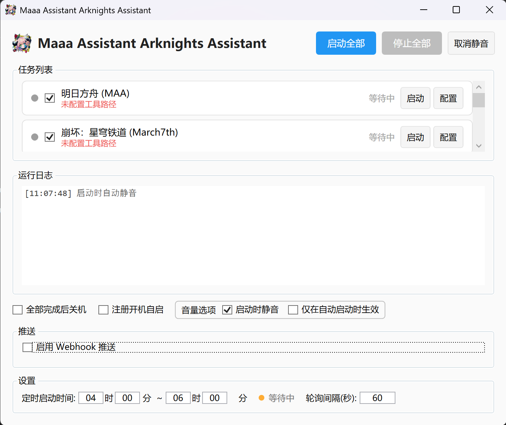

# Maaa Assistant Arknights Assistant (MAAA)

一个基于 WPF 的游戏日常任务自动化启动器，用于统一管理和编排多款游戏的自动化工具。

<p align="center">
  
</p>

## 功能

- **任务链编排**：按顺序自动执行多个游戏的日常任务，前一个游戏进程退出后自动启动下一个

- **进程监控**：实时轮询监控游戏进程状态（启动、运行中、已退出）

- **任务超时**：每个任务可配置超时时间（默认 60 分钟），超时后标记为红色"已超时"并继续下一个任务

- **可视化管理**：GUI 界面展示所有任务状态，支持单独启动或全部启动

- **路径可配置**：所有自动化工具路径通过 JSON 配置文件管理，支持在界面中直接修改

- **音量控制**：启动时自动静音，避免凌晨执行时打扰

- **开机自启**：一键注册/取消 Windows 开机自启（基于注册表 `HKCU\...\Run`，无需管理员权限）

- **定时启动窗口**：可配置允许自动启动的时间范围（如 04:00 ~ 06:00），程序运行期间持续检测，进入时间窗口时自动启动任务链

- **完成后关机**：全部任务完成后可自动关机

- **Webhook 推送**：每条日志触发时可通过 HTTP POST 推送到指定 URL，支持自定义 Body 模板（`__TIME__`、`__CONTENT__` 占位符），内置测试按钮

<p align="center">
  
</p>

## 支持的游戏及自动化工具

| 游戏           | 自动化工具                                                                           |
| -------------- | ------------------------------------------------------------------------------------ |
| 明日方舟       | [MAA](https://github.com/MaaAssistantArknights/MaaAssistantArknights)                |
| 崩坏：星穹铁道 | [March7th Assistant](https://github.com/moesnow/March7thAssistant)                   |
| 绝区零         | [ZenlessZoneZero-OneDragon](https://github.com/DoctorReid/ZenlessZoneZero-OneDragon) |
| 原神           | [BetterGI](https://github.com/babalae/better-genshin-impact)                         |
| 鸣潮           | [ok-ww](https://github.com/ok-oldking/ok-ww)                                         |

## 安装

从 [Releases](https://github.com/SHthemW/MaaaAssistantArknightsAssistant/releases) 页面下载最新版本，解压后运行即可。

## 配置

首次运行会自动生成 `appsettings.Local.json` 配置文件（不纳入版本控制）。可直接编辑该文件或在程序界面中修改：

- 各工具的可执行文件路径和启动参数
- 需要监控的游戏进程名
- 启动前延迟时间
- 每个任务的超时时间（分钟）
- 定时启动时间范围和轮询间隔
- Webhook 推送 URL 和 Body 模板

## 开发

### 环境要求

- Windows 10/11
- [.NET 8.0 SDK](https://dotnet.microsoft.com/download/dotnet/8.0)

### 构建与运行

```bash
dotnet build
dotnet run
```

### 发布

```bash
dotnet publish -c Release -r win-x64 --self-contained false
```

发布后会自动压缩为 zip，输出到 `bin/Release-Archives/`，文件名格式为 `MaaaAssistantArknightsAssistant-{平台}-{日期时间}.zip`。

### 项目结构

```
├── Game-Daily-Routine-Launcher.csproj
├── appsettings.Local.json    # 本地配置（自动生成，不纳入版本控制）
├── res/
│   └── icon.png              # 程序图标
└── src/
    ├── App.xaml              # 应用入口与全局样式
    ├── MainWindow.xaml       # 主界面
    ├── Models/               # 数据模型（任务配置、状态枚举）
    ├── Services/             # 业务逻辑（配置、进程监控、任务链、音量、系统）
    ├── ViewModels/           # MVVM ViewModel
    └── Converters/           # WPF 值转换器
```

<br/>

# Maaa Assistant Arknights Assistant (MAAA)

A WPF-based game daily routine automation launcher for managing and orchestrating automation tools across multiple games.

<p align="center">
  
</p>

## Features

- **Task Chain Orchestration**: Sequentially execute daily tasks for multiple games — automatically starts the next task when the previous game process exits
- **Process Monitoring**: Real-time polling of game process status (started, running, exited)
- **Task Timeout**: Per-task configurable timeout (default 60 minutes) — timed-out tasks are marked red and the chain continues
- **Visual Management**: GUI displaying all task statuses with individual or batch launch support
- **Configurable Paths**: All automation tool paths managed via JSON config, editable directly in the UI
- **Volume Control**: Auto-mute on launch to avoid disturbance during early morning runs
- **Auto-Start on Login**: One-click registration via Windows Registry (`HKCU\...\Run`), no admin privileges required
- **Scheduled Time Window**: Configure an allowed auto-start time range (e.g., 04:00 ~ 06:00) — continuously monitored at runtime, automatically starts the task chain when entering the window
- **Shutdown on Completion**: Optionally shut down the PC after all tasks finish
- **Webhook Notifications**: HTTP POST on every log entry to a configured URL with customizable body template (`__TIME__`, `__CONTENT__` placeholders), includes a test button

## Supported Games & Automation Tools

| Game              | Automation Tool                                                                      |
| ----------------- | ------------------------------------------------------------------------------------ |
| Arknights         | [MAA](https://github.com/MaaAssistantArknights/MaaAssistantArknights)                |
| Honkai: Star Rail | [March7th Assistant](https://github.com/moesnow/March7thAssistant)                   |
| Zenless Zone Zero | [ZenlessZoneZero-OneDragon](https://github.com/DoctorReid/ZenlessZoneZero-OneDragon) |
| Genshin Impact    | [BetterGI](https://github.com/babalae/better-genshin-impact)                         |
| Wuthering Waves   | [ok-ww](https://github.com/ok-oldking/ok-ww)                                         |

## Installation

Download the latest version from the [Releases](https://github.com/SHthemW/MaaaAssistantArknightsAssistant/releases) page, extract, and run.

## Configuration

On first launch, an `appsettings.Local.json` config file is auto-generated (not tracked in version control). Edit it directly or through the program UI:

- Executable paths and arguments for each tool
- Game process names to monitor
- Pre-launch delay
- Per-task timeout (minutes)
- Scheduled time window and polling interval
- Webhook URL and body template

## Development

### Requirements

- Windows 10/11
- [.NET 8.0 SDK](https://dotnet.microsoft.com/download/dotnet/8.0)

### Build & Run

```bash
dotnet build
dotnet run
```

### Publish

```bash
dotnet publish -c Release -r win-x64 --self-contained false
```

After publish, the output is automatically zipped to `bin/Release-Archives/` with the filename format `MaaaAssistantArknightsAssistant-{RID}-{yyyyMMdd-HHmm}.zip`.

### Project Structure

```
├── Game-Daily-Routine-Launcher.csproj
├── appsettings.Local.json    # Local config (auto-generated, not version-controlled)
├── res/
│   └── icon.png              # Application icon
└── src/
    ├── App.xaml              # App entry & global styles
    ├── MainWindow.xaml       # Main window UI
    ├── Models/               # Data models (task config, state enum)
    ├── Services/             # Business logic (config, process monitor, task chain, audio, system)
    ├── ViewModels/           # MVVM ViewModels
    └── Converters/           # WPF value converters
```

<br/>
<br/>

<p align="center">
  
</p>
